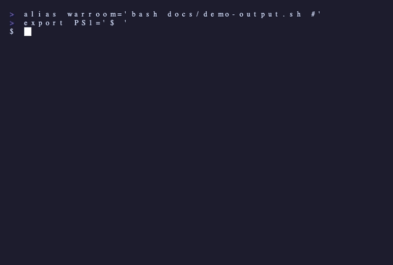

<div align="center">

# warroom

### 5 AI agents enter the war room.
### They debate, build, and review your code.

[](https://www.npmjs.com/package/warroom)
[](https://github.com/Djsand/warroom/actions/workflows/ci.yml)
[](LICENSE)



</div>

---

> Give it a task. Five agents argue about the design, implement it, review each other's work, and try to break it. You get finished code **and a conversation showing exactly how they got there.**

```
  warroom
  5 agents. 1 task. Let the debate begin.

  Task: Add a hello world Express server

  ────────────────────────────────────────────
  Phase 1: Design
  ────────────────────────────────────────────
  [ARC] Architect  I propose splitting server.js from index.js. The app...
  [CHL] Challenger  Two real issues. No "main" in package.json -- npm st...
  [ARC] Architect  Both valid. Adding start script, main field, and err...
  [CHL] Challenger  Design approved. Error handling on the server instan...

  ────────────────────────────────────────────
  Phase 2: Build
  ────────────────────────────────────────────
  [BLD] Builder  Implemented. 4 files. server.js exports app without...
  4 files written

  ────────────────────────────────────────────
  Phase 3: Review
  ────────────────────────────────────────────
  [REV] Reviewer  LGTM. server.js/index.js split is correct. Error han...
  [BRK] Breaker  Two real bugs. PORT=0 reports "port 0" instead of ac...

  DONE

  5 agents · 6 messages · 1 revision · 2 bugs caught · 4 files · 70s
```

---

## Install

### Claude Code plugin (recommended)

```bash
claude plugin marketplace add https://github.com/Djsand/warroom
claude plugin install warroom
```

Then:

```
/warroom "Add user authentication with OAuth"
```

No API key needed. Uses your Claude Code subscription.

### Standalone CLI

```bash
npx warroom setup --token $(claude setup-token)
npx warroom run "Add user authentication with OAuth"
```

Or with an API key:

```bash
export ANTHROPIC_API_KEY=sk-ant-...
npx warroom run "Add user authentication with OAuth"
```

---

## How it works

```
         ┌─────────────┐
         │  Your task   │
         └──────┬───────┘
                │
    ┌───────────▼───────────┐
    │   Phase 1: DESIGN     │  Architect proposes.
    │   Architect + Challenger  Challenger attacks.
    │   debate 2-4 rounds   │  They revise until
    │                       │  the design holds.
    └───────────┬───────────┘
                │
    ┌───────────▼───────────┐
    │   Phase 2: BUILD      │  Builder implements
    │   Builder writes code │  the agreed design.
    └───────────┬───────────┘
                │
    ┌───────────▼───────────┐
    │   Phase 3: REVIEW     │  Reviewer checks quality.
    │   Reviewer + Breaker  │  Breaker tries to
    │   examine the code    │  break everything.
    └───────────┬───────────┘
                │
    ┌───────────▼───────────┐
    │   Phase 4: FINALIZE   │  conversation.md
    │   Save conversation   │  summary.md
    │   and summary         │  code on branch
    └───────────────────────┘
```

---

## The 5 Agents

| Agent | Tag | What it does | Optimizes for |
|-------|-----|-------------|---------------|
| **Architect** | `ARC` | Proposes designs, revises based on critique | Elegance and maintainability |
| **Challenger** | `CHL` | Finds gaps and edge cases, attacks every proposal | Robustness and completeness |
| **Builder** | `BLD` | Implements the agreed design | Simplicity and shipping |
| **Reviewer** | `REV` | Reviews code for bugs and quality issues | Quality and best practices |
| **Breaker** | `BRK` | Tries to break everything with adversarial tests | Finding failures |

Each agent has a different objective function. They genuinely disagree. That's what makes the conversations interesting.

---

## What you get

```
.warroom/conversations/
├── conversation.md    <- Full agent debate (shareable)
└── summary.md         <- What was built, decisions made, bugs caught
```

The conversation is the product. Screenshot it. Share it. Learn from it.

---

## Commands

```
warroom run <task>       Assign a task to the agent team
warroom setup            Authenticate (setup token or API key)
warroom setup --login    Browser-based OAuth login
warroom read             Read the latest conversation
warroom read --format html   Export as standalone HTML
warroom status           List all conversations
```

---

## Auth (standalone only)

The plugin mode needs no configuration.

```bash
# Use your Claude subscription (recommended)
warroom setup --token <paste from `claude setup-token`>

# Or use an API key
export ANTHROPIC_API_KEY=sk-ant-...
```

---

## Examples

Real conversations from warroom sessions — each one shows the agents debating, catching bugs, and refining code:

- [Express Server](examples/express-server.md) — 2 bugs caught in a simple hello world
- [JWT Authentication](examples/auth-system.md) — 3 security issues found by Breaker
- [CSV to JSON CLI](examples/cli-tool.md) — streaming architecture stress-tested
- [React Todo App](examples/react-todo-app.md) — localStorage race conditions and state bugs
- [Database Schema](examples/database-schema.md) — multi-tenant isolation flaws exposed
- [WebSocket Chat](examples/websocket-chat.md) — XSS, flooding, and 10k connection limits

Want to add your own? See [CONTRIBUTING.md](CONTRIBUTING.md).

---

## License

MIT
